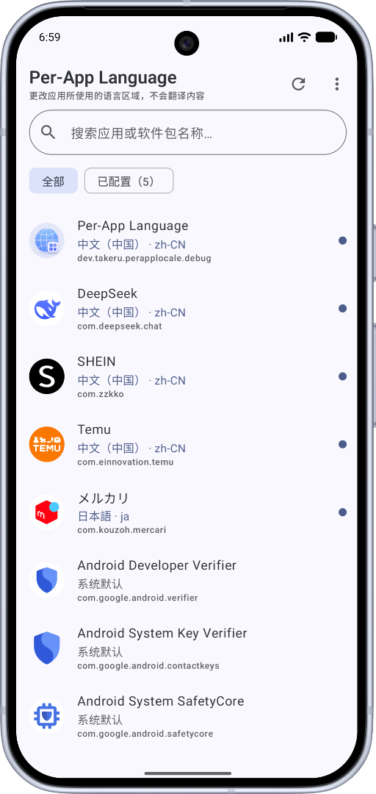
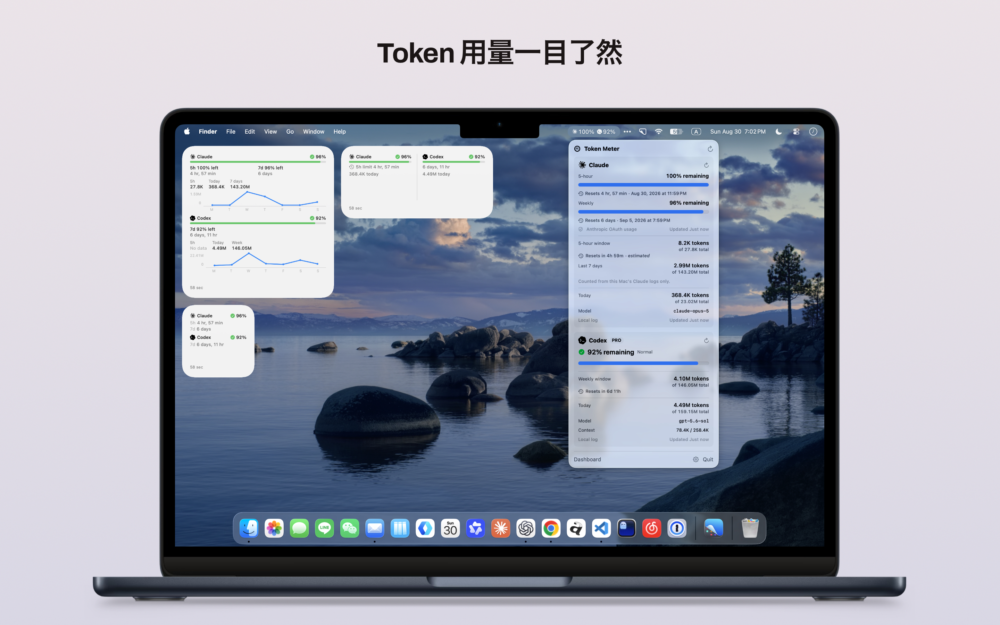
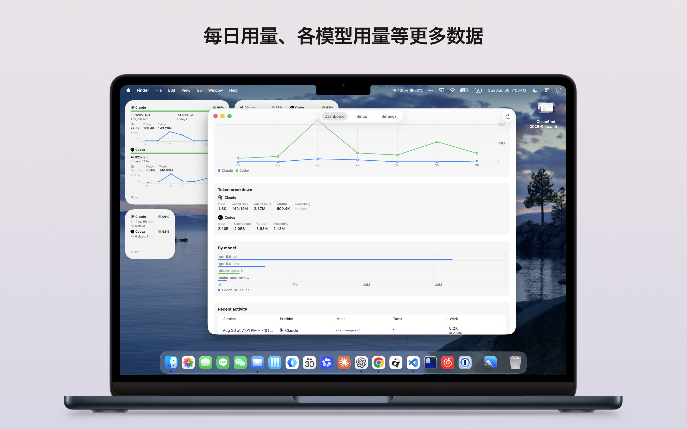
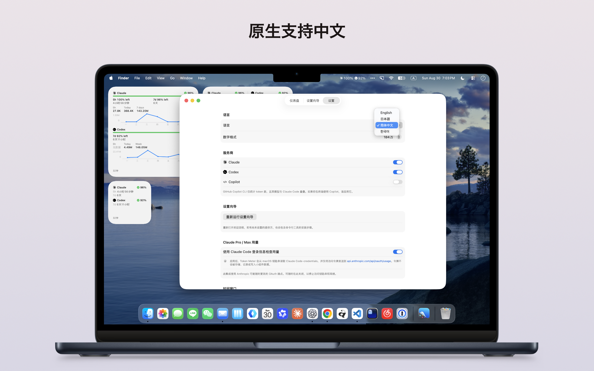

# 我的作品

我是 Takeru，一名来自东京的学生开发者和产品创作者。我主要开发实用的移动应用与开发者工具。

## 应用语言切换器

一款免费开源的 Android 工具，无需 Root，通过 Shizuku 为不同应用设置不同的显示语言。即使应用没有出现在系统的“应用语言”页面中，也可以尝试设置；实际显示效果取决于应用是否提供对应语言资源。

**支持平台：** Android 13 及以上版本（需要 Shizuku）

  

  

[产品介绍](https://github.com/TakeruF/android-perapp-language-selector/blob/main/README.zh-CN.md) · [全部版本](https://github.com/TakeruF/android-perapp-language-selector/releases/latest) · [源代码](https://github.com/TakeruF/android-perapp-language-selector)

## Token Meter

一款原生的用量查看工具，可汇总 Claude Code、Codex 和 Copilot CLI 的本地会话数据，帮助查看每日、每周及用量限制信息。

**支持平台：** macOS（Windows 版正在开发中，暂未提供）

  
  
  

[产品介绍](https://takeruf.github.io/token_meter/) · [macOS 下载](https://github.com/TakeruF/token_meter/releases/latest) · [源代码](https://github.com/TakeruF/token_meter)

## 开源项目 / MCP

- **[China Rail MCP](https://github.com/TakeruF/china-rail-mcp)**：只读的中国铁路 MCP 服务器，可查询 12306 车站、时刻、票价、余票、车次和经停站，不提供订票或账户自动化功能。
- **[Japan Rail MCP](https://github.com/TakeruF/japan-rail-mcp)**：以新干线为重点的只读 MCP 服务器。无需凭据即可查询车站目录；配置 Ekispert API 密钥后，还可查询实时列车时刻、票价、席别和经停站。
- **[MCP Mail Core](https://github.com/TakeruF/mcp-mail-core)**：以安全为重点的多账户邮件 MCP 核心与服务商接口，适用于 Gmail、QQ 邮箱和 iCloud 邮箱集成。
- **[Silkroad MCP](https://github.com/TakeruF/silkroad-mcp)**：面向亚洲服务、设备和标准协议的 MCP 项目目录，包含可复用组件、蓝图与模板。

## 关于我

[GitHub 主页](https://github.com/TakeruF)
